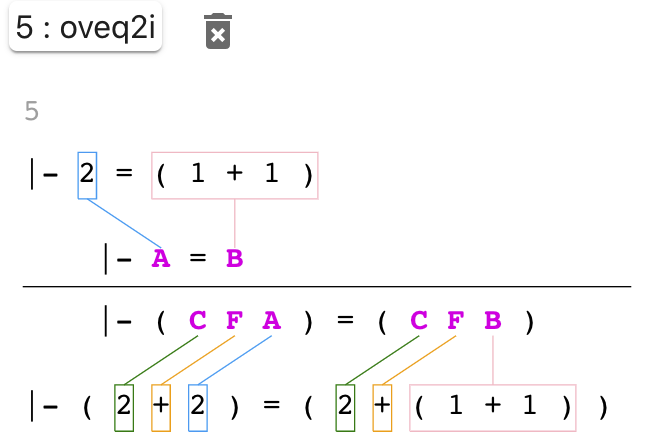

# Metamath-lamp Guide

Metamath-lamp (Lite Assistant for Metamath Proofs) is
a proof assistant for creating formal
mathematical proofs in the [Metamath system](https://us.metamath.org/).
Unlike most other Metamath proof systems
(such as mmj2 or original metamath-exe),
users can use this proof assistant without installing anything;
you can simply run it directly using your web browser.
More information on metamath-lamp is available at the
[metamath-lamp source code repository](https://github.com/expln/metamath-lamp).

This is a guide for metamath-lamp, including both a
user guide (tutorial) and a reference guide.
We'll begin with a "quick start"
(a brief introduction on how to start and use metamath-lamp).
This will be followed by a user guide,
basically a sequence of worked examples showing how to use the tool
(starting with a proof that two plus two equals four).
The rest of this guide is a reference guide,
explaining the various parts of the user interface.
We conclude with how to get or share more information.

Note that metamath-lamp changes over time, so some of this guide
may not exactly match what you see. If you see a difference, please
let us know so we can fix this guide. We try to make this guide
match the tool it's describing.

## Quickstart

You don't need to install anything to run metamath-lamp.
To start metamath-lamp,
just use you web browser and view the
**[main Metamath-lamp web site](https://expln.github.io/lamp/latest/index.html)**
or some other metamath-lamp web site.

To use metamath-lamp, do the following:

* Load the proof context (the databases you'll use and their scope).
* Set the fundamental proof information where desired (its
  description, variables, and disjoints).
* Add the goal ("qed") and any hypotheses to the list of statements.
  Set their ids to what you want them to be in the final database.
* Now create the proof.
  To do this, you add other statements and repeatedly unify them
  until the goal is completely proven.
  You can create the proof bottom-up, top-down, middle-out, or
  whatever other order makes sense to you.
* Copy the compressed proof of the goal into the clipboard.
  You can do this by selecting the green checkmark next to the goal
  to show the compressed proof, then press copy.
  You'd typically copy that compressed proof into a Metamath database
  (text file).

Throughout metamath-lamp there are various tooltips.
So if you hover over an iteractive item,
in most cases the tool will provide a brief
explanation of what that item does.
You don't need to memorize this guide!

This software works on many different systems which have different conventions.
On some Macintosh keyboards the "Enter" key is instead labelled "Return" and
the "Alt" key is instead labelled "Opt" or "Option".
On a touchscreen (like a smartphone), a quick touch and release on a UI
control is the same as a left click.
Metamath-lamp has some actions that are quickly accessed using Alt+left click
(hold down the Alt aka Opt key, and while holding it use left click).

## User guide (tutorial)

This is the user guide (tutorial) portion of this overall guide.
In this section we will explain how to use metamath-lamp to create some
proofs by creating some example proofs.
We recommend starting the tool and apply these examples.

We will start with a simple proof that 2 + 2 = 4.

### Proof: 2 + 2 = 4

Let's show how to use metamath-lamp to create a simple proof, namely,
that 2 + 2 = 4. This has already been proved in the set.mm database
as theorem `2p2e4`.

#### Selecting the proof context for 2p2e4

We first need to decide on the proof context, that is, the database(s)
of axioms and proven theorems we'll use. In this case we'll use the most
common metamath database, `set.mm`. This database uses the very common starting
points of classical first-order logic and ZFC set theory.
We'll also tell it to *stop* using the database just before its
proof of 2 + 2 = 4, which in this database is named `2p2e4`.
If we included the existing proof, the prover
would simply reuse that existing proof.

> Select Source type "Web", Alias "set.mm:latest"; after confirmation this
> loads the given database.
> Now under scope select "Stop before" and enter the label "2p2e4".
> Finally, apply changes to the context.

#### Setting the goal for 2p2e4

For this example we'll leave the proof description, variables, and disjoints
blank. We do need to tell metamath-lamp our goal.

> In the Editor select "+"  (add new statement). Enter
> `|- ( 2 + 2 ) = 4`
> and press Enter (Return) to save the result.

Be sure to surround each symbol by at least one space (the first
and last symbols can start and end the statement).

The set.mm database is picky about the placement of parentheses.
For example, set.mm requires that the infix "+"
be surrounded by parentheses; the parentheses are *not* optional.
More generally,
when a function that takes two classes and produces a class is applied
as part of an infix expression, the expression is always surrounded by
parentheses.
For example, the use of "+" in <tt>( 2 + 2 )</tt>.
Similarly, predicate expressions in infix form that take two or three wffs
(a true or false value) and produce a wff are also always
surrounded by parentheses, such as <tt>( ph -> ps )</tt>.  In contrast,
a binary relation (which compares two classes and produces a wff)
applied in an infix expression is *not* surrounded by parentheses. This
includes set membership, for example, "1 e. RR" (1 is a member
of the set of real numbers) has no parentheses.

For our purposes, we're going to rename our goal.
Renaming the target statement (as well as any other statement) is
not required by metamath-lamp. You could instead just continue using the
label metamath-lamp suggested. But renaming some of the statements
(especially the target one) makes them easier to distinguish for you
and eventually this name will appear in the final generated proof.
If you don't know what else to name the goal, we suggest using the name
"qed" to reduce confusion.

If you plan to eventually add this proof to the set.mm or iset.mm
databases then you need to follow the set.mm database conventions,
including its conventions for naming labels.
In most cases, the name of a theorem is a concatentation of
"label fragments" of the important part of its conclusion.
Each label fragment as a meaning, e.g., "nn" for natural numbers,
"re" for real numbers, "1" for the number 1, "gt" for "greater than",
"le" for less than, "an" for the boolean operation "and", and so on.
Most symbols are defined by an assertion named "df-NAME", where
NAME is the label fragment used. Note that in set.mm, "natural number"
means an integer that is one or larger.
Thus, in set.mm, "nnre" represents "the natural numbers are real numbers",
and "nnge1" represents "the natural numbers are greater than or equal
to 1".
You can see the [set.mm label naming conventions](https://us.metamath.org/mpeuni/conventions-labels.html)
and
[set.mm general conventions](https://us.metamath.org/mpeuni/conventions.html)
for more details.

In set.mm the label naming convention for
a simple arithmetic expression is to use "p" for "plus" and "e" for "equals".
Thus, let's rename this goal statement to "2p2e4" to follow its conventions:

> Select the statement number (1) using the left mouse button.
> Change the name of the statement to "2p2e4" and press Enter (Return).

#### Deciding on a proof strategy for 2p2e4

Now we need to figure out how to prove this goal.

Metamath-lamp can actually do some things automatically. However, we will
*intentionally* avoid some of those automations to see how to
prove something in cases where the automations can't do enough.

There are many different ways to create a proof, including top-down,
bottom-up, or even middle-out. Metamath-lamp supports them all.
Also, note that there are often many proofs for the same true statement.
Here we're going to show one way to do it, as an example.

In many cases we can prove a statement by identifying definitions of
what we want to prove, finding their expansions, and repeatedly
expanding and simplifying the
results to show that what we want to prove is correct.

#### Expanding the meaning of 4

In this case, we want to prove that something is 4, so the definition
of 4 would probably be useful.
We'll search for the definition of 4 so we can add it to our
list of statements.

> Select the magnifying glass (search) icon; under pattern enter
> `4 =` and click on Search.
> Select the statement labelled `df-4` and press "Choose Selected".
> You will now have a new statement with an id of 1:
> `|- 4 = ( 3 + 1 )`

Notice that to the right of the id, and the left of the statement
(starting with `|-`), there is a bold letter **P**
This bold letter **P**
means that this statement is intended to be *provable*.
In some cases you'll want a statement to be a
*hypothesis* instead being *provable*.
You can select the **P** with Alt+left click to change it to
to an **H** (hypothesis) or back to **P** (provable).
We aren't going to use any hypotheses
in this proof, so we won't do that for now.

This definition of 4 depends on the definition of 3, so let's add
the definition of 3 as well.
Note that `df-4` is the definition of 4; this suggests a naming convention,
so we can probably just use the naming convention to find it.

> Select the magnifying glass (search) icon; in the "label" field
> enter `df-3` and click on Search.
> Select the statement labelled `df-3` and press "Choose Selected".
> You will now have a new statement with an id of 2:
> `|- 3 = ( 2 + 1 )`

We can connect the definition of 4 using the definition 3 by simply
adding 1 to both sides of the definition of 3.
We can simply add this statement as a claim and see if metamath-lamp
can find a statement that proves this is correct (in this case it can).
In fact, if you take very small steps, metamath-lamp can prove a number
of statements automatically.

We don't want to add this statement as the *last* statement,
so we'll select the last statement before adding it (so we'll
insert that statement before it).

> Select the checkbox to the left of the "2p2e4" goal statement.
> Then select "+" (add new statement).
> Notice that because a statement was selected, the new statement will
> be inserted before "2p2e4".
> Enter the new statement
> `|- ( 3 + 1 ) = ( ( 2 + 1 ) + 1 )`
> and press Enter (Return).
> Unselect the checkbox to the left of the "2p2e4" statement.
> Now, while no statements are selected,
> press unify (the multiple-connected dots symbol). Since there
> was no specific statement selected, it will try to justify all statements.
> Metamath-lamp will succeed in finding a justification for our new statement,
> so it will show a green checkmark next to our new statement.

We could later on connect this proof of `( 3 + 1 )` to the number 4.
However, in a more complex proof we might forget that we were trying
to prove an expansion of a value in the goal (4 in this case).
So let's "clean up" now by directly proving that this term is an
expansion of a symbol in the goal. Instead of typing it all in, we'll
use the "duplicate" command to get us started:

> Select the checkbox to the left of the new statement
> `|- ( 3 + 1 ) = ( ( 2 + 1 ) + 1 )`
> and press the "duplicate" icon (double circles behind a "+").
> This will create a duplicate statement below the current one.
> Click on the new statement text, and change `( 3 + 1 )` to 4; once you have
> `|- 4 = ( ( 2 + 1 ) + 1 )`
> press Enter (Return).
> Press unify, which will produce a green checkmark next to all the statements
> except our final "2p2e4" statement.

#### Expanding the meaning of ( 2 + 2 )

Our goal involves showing that the symbol `2` and `4` have some kind
of relationship. A common technique to create proofs is to expand
the definitions of terms and then show that their expansions are equivalent.
We've already expanded `4`, let's now expand `2`.

> Select the magnifying glass (search) icon; in the "label" field
> enter `df-2` and click on Search.
> Select the statement labelled `df-2` and press "Choose Selected".
> You will now have a new statement:
> `|- 2 = ( 1 + 1 )`

This definition of `2` is similar to the value we expanded for `4`.
Both have a `1` followed by another `1` at their end.
We can take the definition of `2` and add `2` to both sides, at the
beginning of each side, to produce a very similar expression.
Let's try that.

> Select the checkbox to the left of the new statement
> `|- 2 = ( 1 + 1 )` and then press the icon showing
> "+" with circles behind it (the duplicate statement icon).
> Left-click on it.
> Modify it so the new statement is
> `|- ( 2 + 2 ) = ( 2 + ( 1 + 1 ) )`
> and press Enter (Return).
> Now press unify (the multiple-connected dots symbol). Since there
> was no specific statement selected, it will try to justify all statements.
> Metamath-lamp will succeed in finding a justification for our new statement,
> so it will show a green checkmark next to our new statement.

#### Showing these expansions are equal

At this point we've shown that `4` and `( 2 + 2 )` are separately
equal to very similar expressions. If we could prove that those expressions
are equal to each other, we could trivially prove our goal.
Let's try to do that.

> Select the checkbox to the left of the "2p2e4" goal statement.
> Select "+" (add new statement). Enter the new statement
> `|- ( ( 2 + 1 ) + 1 ) = ( 2 + ( 1 + 1 ) )`
> and press Enter (Return).
> Unselect the "2p2e4" statement.
> As an experiment, select Unify while there's no statement selected;
> you'll see that in this case it did *not* find a justification
> for our new statement.

It's actually true that
`( ( 2 + 1 ) + 1 )` is equal to `( 2 + ( 1 + 1 ) )`.
That's because addition is associative
(you can do the first or second addition first and the result is the same).
The Metamath database in this context already has a proof that
addition is associative, too.

However, when you press "unify" without selecting any statements,
metamath-lamp will not automatically prove this new statement,
even though the Metamath database in this context
*does* have a proof of this statement.
The reason is that the rule in this Metamath
database requires some preconditions that are not currently
included in our proof.

So we'll instead use a bottom-up search, which will try to find and
prove any other statements necessary to apply a relevant existing proof.
A bottom-up search *can* add new statements.
You enable a bottom-up search by selecting the statement to be proved
and then selecting unify.

> Select the checkbox next to our latest statement
> `|- ( ( 2 + 1 ) + 1 ) = ( 2 + ( 1 + 1 ) )`
> and press "Unify".
> A new dialogue will display titled "Proving bottom-up".
> These dialogue options control how metamath-lamp will search for a proof
> of this statement. For now, we'll just accept the defaults and press the
> "Prove" button at the bottom of the dialogue.
> After a moment it will present a list, and one of the first options
> (probably the first one) should use "addassi".
> The theorem "addassi" is a pre-existing theorem showing that
> addition is associative.
> This requires multiple lines, because using this associativity
> theorem requires showing that `1` and `2` are complex numbers.
> Use the checkbox to its
> left to select that one, then press the "Apply Selected" button.

Suddenly a lot has happened.
We now have new statements that have been automatically added to our proof,
namely that `1 e. CC` (`1` is a complex number) and `2 e. CC`
(`2` is a complex number).

> Now, without any statements selected, press "Unify".

We now have a green checkmark next to all our statements, showing
that all statements are have been proven.

Most importantly, the final statement "2p2e4" has a green checkmark, which
means we have proven our goal.
Metamath-lamp automatically unified all the statements,
and was able to complete the rest of the proof given what we had provided.

#### Getting the completed proof

We can now show the compressed proof.
This is the final proof we can add to a Metamath database.

> Select the green checkmark (*not* "P") on the "2p2e4" goal statement.
>
> You can select "Copy" to copy the compressed proof into the clipboard.
> Press "Close"

#### Exporting and importing your current state

You can only generate a proof once you *have* a proof.

Metamath-proof can export the current state of your efforts,
whatever they are, and anyone can reload them later.

> Left-click on the "hamburger" icon
> (3 short horizontal lines)
> on the top right of the display.

This will show several ways to export and import your
current state:

* "Export to URL": Provides a URL. You or anyone else
  can use this URL to re-open the proof assistant at
  this current state.
* "Export to JSON": Provides the current proof assistant
  state as text; you can save this where you wish.
* "Import to JSON": Allows you to load a state previously
  exported with "Export to JSON".

#### Looking at proof steps

In Metamath, *every* step of a valid proof must be an
application of an axiom or a previously-proven statement.
Metamath-lamp shows when it can verify this for a statement
(after unification) by displaying a green checkmark.

Let's look at how metamath-lamp can justify some steps.
We'll start with the claim that
`|- ( 2 + 2 ) = ( 2 + ( 1 + 1 ) )`:

> Left-click on the **P** next to
> `|- ( 2 + 2 ) = ( 2 + ( 1 + 1 ) )` to toggle the display
> its justification.

You will show a list of ids that are being used,
colon, and `oveq2i`. This means that this particular
statement is justified (proven) by using the already
accepted theorem `oveq2i` when applied to those ids.
Advanced users can edit this to force metamath-lamp to
try to use a different justification.

But what does this justification *mean*?

Metamath-lamp can provide a visualization to show what
it means. So let's enable it.

> Left-click on the "hamburger" icon
> (3 short horizontal lines)
> on the top right of the display and select
> "Visualization is Off".
> You will see that now "Visualization is On"; left-click
> outside the region to close the hamburger menu.

You should see a visualization like this:

The top new line is set of ids being used as inputs into
the justification. In this case there's only one id;
the id you see may be different than what's shown here.
Under that is a copy of that statement:

> `|- 2 = ( 1 + 1 )`

Notice that variable parts of this statement are boxed
and directed lines connect them to another statement below.
The statement below is the set of required patterns
required by `oveq2i`, in this case `|- A = B`.
The lines show that in this use of `oveq2i`, `A` will be
`2`, and `B` will be `( 1 + 1 )`.

The result of `oveq2i` are `( C F A ) = ( C F B )`.
Any variable in its output must have the same values as
this application of its inputs; `C` and `F` have no
inputs, so they can be anything syntactically valid.
This means we can use `oveq2i` to justify the final claim,
`|- ( 2 + 2 ) = ( 2 + ( 1 + 1 ) )`.

We can also hide justifications (include the visualization)
any time.

> Left-click on the **P** next to
> `|- ( 2 + 2 ) = ( 2 + ( 1 + 1 ) )` to toggle the
> display of its justification; since the justification
> is currently displayed, this will hide it.

Let's do the same thing with statement that
uses associativity,
`|- ( ( 2 + 1 ) + 1 ) = ( 2 + ( 1 + 1 ) )`,

> Left-click on the **P** next to
> `|- ( 2 + 2 ) = ( 2 + ( 1 + 1 ) )` to toggle the
> display of its justification, revealing it.

You can now see that the justification of this statement
is `addassi` (addition is associative).
This justification has multiple requirements, which
as you can see are met.

Let's end its display.

> Left-click on the **P** next to
> `|- ( 2 + 2 ) = ( 2 + ( 1 + 1 ) )` to toggle the
> display of its justification, hiding it again.

#### Reordering statements

You can reorder statements.
Sometimes you *need* to reorder statements, because
statements can only use previously proved statements.

To reorder some some statements,
just select one or more
using the checkboxes on the left, and use the
"up" icon (to move them up) or "down" icon
(to move them down).

> Left-click on checkbox next to
> `|- ( 3 + 1 ) = ( ( 2 + 1 ) + 1 )`
> and press the "up" icon - the statement will move up.

Metamath-lamp will display error messages if statements
are moved to make them depend on statements that
have not been proved yet.

### Proof: The reciprocal of the cotangent is tangent (reccot)

Let's use metamath-lamp to create another proof, namely,
that the reciprocal of the cotangent is tangent.
This has already been proved in the set.mm database as theorem `reccot`.

This proof will show some capabilities we didn't see in the previous
example. This includes work variables (and how to substitute them) and
metamath-lamp's syntax-aware mechanisms for copying and pasting
portions of text (aka "selectors").

This exercise is based on the video showing how to prove the
same theorem using the mmj2 tool
(["Introduction to Metamath and mmj2" by David A. Wheeler](https://www.youtube.com/watch?v=Rst2hZpWUbU))
and an earlier video of
[reccot being proved using metamath-lamp (no sound)](https://drive.google.com/file/d/1IwdHLpQreZ_1CJFZJmptRJc2unO8aNh4/view).

#### Selecting the proof context for reccot

We first need to decide on the proof context, that is, the database(s)
of axioms and proven theorems we'll use. In this case we'll again use the most
common metamath database, `set.mm`. We will again be proving something
already in the database, so we need to make sure our context does not include
its proof (of `reccot`) or metamath-lamp will just reuse it.

If you've already been using metamath-lamp to prove something else, that
means we need to erase the proof steps we have and change the context.
Here's how to do that:

> Select the checkbox on on the editor bar above the field name "Description"
> to select *all* statements. select the trash can with an X
> ("delete selected statements") to delete them all.
> At the top of the browser window, select the dropdown arrow with the
> "Loaded:..." text that hints at the context.
> Make sure we are loading from the web the file "set.mm:latest",
> and change the scope to "Stop before" the label `reccot` by typing it in
> and selecting it.
> Then press "Apply changes" to apply this change.

If, on the other hand, you're starting from scratch, just set up the
context as usual. Here's how to do that instead:

> Select Source type "Web", Alias "set.mm:latest"; after confirmation this
> loads the given database.
> Now under scope select "Stop before" and enter the label "reccot".
> Finally, apply changes to the context.

#### Setting the goal for reccot

For this example we'll leave the proof description, variables, and disjoints
blank. We do need to tell metamath-lamp our goal.

> In the Editor select "+"  (add new statement). Enter
>
> ~~~~metamath
> |- ( ( A e. CC /\ ( sin ` A ) =/= 0 /\ ( cos ` A ) =/= 0 ) ->
>     ( tan ` A ) = ( 1 / ( cot ` A ) ) )
> ~~~~
>
> and press Enter (Return) to save the result.

This is a more complicated goal. It says that
if A is a member of the set of complex numbers, and
the sine of A is not equal to zero, and
the cosine of A is not equal to zero, then the
tangent of A is equal to 1 divided by the cotangent of A.

Be sure to surround each symbol by at least one space (the first
and last symbols can start and end the statement), and be careful
about where the parenthesis go.

Now modify the label of this goal to `reccot`.

> Select the statement number (1) using the left mouse button.
> Change the name of the statement to "reccot" and press Enter (Return).

Let's take a brief look at this goal.
It illustrates several symbols in the set.mm database:

* An uppercase letter like `A` represents a class (any set is also a class).
  By convention we start with `A` unless there's a reason to do otherwise.
* `CC` represents the set of all complex numbers.
* `e.` represents "is a member of"; so `A e. B` is how we write
  "A &isin; B". The expression <tt>A e. CC</tt> means "A is a complex number".
* <tt>&#92;/</tt> represent "and". It's not used here, but
  <tt>/&#92;</tt> represents "or".
* `=/=` represents "not equal to".
* `->` represents "implies". The left-hand-side of an implication is called
  the "antecedent"; the right-hand-side of an implication is called the
  consequent.
* `/` represents complex number division.
* The form <tt>( FUNCTION &#96; ARGUMENT )</tt>
  applies function FUNCTION to argument, that is, it determines the
  value of the function for that argument.
  Therefore <tt>( tan &#96; A )</tt> is the tangent of `A`.
  This left apostrophe notation originated from Peano and was adopted in
  *Principia Mathematica* by Whitehead and Russell, Quine, and others.
  This notation means the same thing as
  the <tt>tan(A)</tt> notation used by others
  but without context-dependent notational ambiguity.

#### Deciding on a proof strategy for reccot

Now we need to figure out how to prove this goal.

In this example our basic strategy will be to expand the tangent and
cotangent into sines and cosines, then show that the results are equal.
We'll again show going forwards.

Note that in real proof efforts you'll often try many different approaches.

#### Beginning to expand the definition of tangent

We know we're going to need more information about the tangent and
cotangent. So let's retrieve their definitions.

Let's first find the definition of the tangent.

> Select the magnifying glass (search) icon.
> In the pattern enter <tt>( tan &#96;</tt> and click on Search.

That produces a huge number of results. We could scroll through many pages
to find what we want and select it.
In this case, let's instead be more specific in our search request.
We want a statement that shows that the value of the tangent is equal
to something using the sine and cosine.

> While still in the search dialogue, modify the search pattern to say
> <tt>( tan &#96; = sin cos</tt> and click on Search.

Notice that this more specific search quickly finds the definition
we want without many irrelevant results.
In this case it finds a statement named `tanval` (value of the tangent).

The default search pattern language is very simple.
A pattern should consist of a space-separated sequence of one or more symbols
(currently only constants are allowed).
Statements will only be considered matches if their conclusion part has
the same constants in the same order, with optionally 1 or more other
symbols before the pattern, between the requested symbols,
and after the pattern.

This definition of the value of a tangent, named `tanval`,
includes an implication.
There's a good reason for this.
The tangent of some value A is the sine of A divided by the cosine of A,
and therefore it's undefined when the cosine of A equals zero.

> While still in the search dialogue, select the box next to `tanval`.
> and press "Choose Selected".

#### Interlude: Work variables

We have a new statement, as expected. However, it has a form we haven't
seen before:

~~~~metamath
|- ( ( &C1 e. CC /\ ( cos ` &C1 ) =/= 0 ) ->
   ( tan ` &C1 ) = ( ( sin ` &C1 ) / ( cos ` &C1 ) ) )
~~~~

The symbols beginning with "&amp;" are what's called "work variables".
If you've used the mmj2 tool, this is the same thing as mmj2's work variables.
Work variables often show up when creating proofs.
The fundamental issue is that although a theorem or axiom may use a variable
(such as `A`), those variables can be replaced with other expressions
when they are used.
In this case,
the original "tanval" showed what the results are when `A` is the argument,
but we aren't limited to using `A`; we can use any expression that
produces a class.
In cases where metamath-lamp cannot be certain of exactly what you want, it
will create work variables that you can then replace (substitute)
with whatever you *do* want.

When using set.mm or iset.mm, you'll see work variables of certain forms:

* &amp;W<i>number</i> : an expression that is a well-formed formula (wff),
  in short, some value that is true or false.
  This could be a variable that is a wff, such as
  `ph` (the ASCII representation for "&#x1D711;"),
  `ps` (for "&#x1D713;"),
  `ch` (for "&#x1D712;"), or
  `th` (for "&#x1D703;").
  But it could be any other wff expression, such as `ph /\ ps`.
* &amp;C<i>number</i> : an expression that is a class.
  Any set is a class (though not all classes are sets).
  This could be a variable that is a class, such as
  `A`, `B`, `C`, and so on. It could also be an expression that is a class,
  such as <tt>( sin &#96; A )</tt>.
* &amp;S<i>number</i> : a set variable.
  This represents a variable that represents a set, such as `x`, `y`, or `z`.
  This can't be an expression (class variables are used in this case).
  Set variables can show up immediately after quantifiers; requiring them
  to be a variable ensures that they are syntactically valid.
  
In work variables the number will increase from 1 as needed to keep
different work variables distinct..

If you look carefully you'll see that the "Variables" field in the
proof display has
new information. What's saying is that there's a work variable of type "class"
with the name "&amp;C1". This field is helpful when proofs get long, because
it will show you in one place what variables are still not handled.

As we'll see in a moment, we'll use the
icon "A with an arrow under it" (apply a substitution) to replace
the work variables with symbols or expressions so we can complete
the proof.

#### Completing the work to expand the definition of tangent

We need to replace each work variable with an expression of the correct type
that will help us prove our goal.
What should we do in this case?
Well, the goal is going to involve the tangent of `A`, so we know
we're going to specifically need the tangent of `A`.
That means that we need to replace all instances of <tt>&amp;C1</tt>
with the value `A`. This process of replacing values is called
applying a substitution.

> Select the icon A with an arrow under it (apply a substitution).
> Since we didn't select any particular statements, this will apply to
> all statements. In "Replace what" enter <tt>&amp;C1</tt> and in "Replace with"
> enter `A` - once that's done, press "Find Substitution".
> The system will check if this is valid; in this case, it could that
> there was only 1 way to interpret this command and that the result is valid.
> It will show you that you can change <tt>&amp;C1</tt> to `A` - press
> `Apply` to apply the change.

#### Expanding the definition of cotangent

We also need the definition of cotangent.
You may have noticed that the definition of the value of tangent
was named `tanval` - that suggests a naming convention that we could use
to make searching easier. In set.mm, the definition for finding a value
of a function is usually the function's abbreviated name followed by `val`.
Let's exploit that.

> Select the magnifying glass (search) icon.
> In the label field (not the pattern field)
> enter `cotval`  and click on Search.
> Select `cotval` and click on "Choose Selected".

We again have a work variable, and we already know what its value
should be, so let's deal with that now.

> Select the icon A with an arrow under it (apply a substitution).
> Since we didn't select any particular statements, this will apply to
> all statements. In "Replace what" enter <tt>&amp;C1</tt> and in "Replace with"
> enter `A` - once that's done, press "Find Substitution".
> It will show you that you can change <tt>&amp;C1</tt> to `A` - press
> `Apply` to apply the change.

#### What does reciprocal do?

The goal involves a reciprocal, so we need to find an existing theorem
that proves "what a reciprocal does for me".
What I want to find is something like `( 1 / ( A / B ) ) = ( B / A )`.
We don't need to type that in exactly, let's just search listing some of the
symbols that aren't variables.

> Select the magnifying glass (search) icon.
> In the pattern enter `1 / / = /` and click on Search.
> In a moment it will show a paged list of results.

There are multiple pages of results, so I have to look through some pages.
Some of the results are really long; I can quickly ignore those.
However, after looking at my options I find `recdiv` and that *is*
what I want!

> Select the checkbox to the left of `recdiv` - then scroll to the
> bottom and click on "Choose Selected".

Now we have two work variables, representing the numerator and
denominator of the fraction being reciprocated.
Notice that the "Variables" field lists these two variables.

We'll come back this in a moment.

#### Matching the goal's antecedent for tangent

The goal is an implication; the antecedent of this implication
has 3 requirements.
However, the definition of the tangent value and cotangent value don't
exactly match the goal antecedent.
We need to prove that we can use these values
with the exact antecedents in our goal.

This will be easier to do if we duplicate an existing statement and
modify it.

> Select the checkbox to the left of the expression using `tan`.
> Press the icon showing "+" with multiple circles (duplicate statement);
> this will create a copy of the selected statement below the current
> statement.

An easy way to modify the new statement is to
use metamath-lamp's mechanisms for copying and pasting
portions of text (aka "selectors").

> Using Alt+left click, select the *second* parenthesis of the *goal*
> statement. This will smartly select a syntactically complete portion
> of the statement and bring up a selector dialogue below the statement.

The selector dialogue has icons to smartly expand the selection,
shrink the selection, add a new statement above with that selection,
add a new statement below with that selection,
copy the selected text to the clipboard, edit that text,
and unselect (close the selector dialogue).

> To get an idea of what the selector dialogue can do,
> click on its leftmost icon with arrows going out ("expand selection")
> and then the next icon with arrows going in ("shrink selection").
> Note that the tool is selecting the symbols based on the
> syntax of the symbols.

In this case, we want to make a copy of the selected
text in the goal, then paste that into
the relevant section of the new statement.

> Press the box-on-box icon (copy to clipboard) under the goal statement.
> Now use Alt+left click on the second parenthesis of the new statement
> we just created, selecting its antecedent.
> Press on the pencil icon ("edit"), then use your system's paste command
> ("control-V" on most computers, "command-V" on Macintoshes) to overwrite
> the selected text with the text in the clipboard.
> Press Enter (Return) to save the modified statement.

We now have a new statement, showing value of a tangent is still
valid given the antecedent of our goal:

~~~~metamath
|- ( ( A e. CC /\ ( sin ` A ) =/= 0 /\ ( cos ` A ) =/= 0 ) ->
     ( tan ` A ) = ( ( sin ` A ) / ( cos ` A ) ) )
~~~~

It turns out that metamath-lamp can immediately prove this new statement.

> Press the "Unify" icon near the top. Note that the new
> statement now has a green checkmark.

You can click on any bold **P** to show the justification for each
statement with a green checkmark; press the same bold **P** again
to hide the justification.

#### Matching the goal's antecedent for cotangent

Let's do the same thing with the definition of the value of the
cotangent, showing we can use this definition even given the
antecedent of the goal.

> Select the checkbox to the left of the expression using `cot`.
> Press the icon showing "+" with multiple circles (duplicate statement).
> Using Alt+left click, select the *second* parenthesis of the *goal*
> statement to select the antecedent of the goal.
> Press the box-on-box icon (copy to clipboard) under the goal statement.
> Now use Alt+left click on the second parenthesis of the new statement
> we just created, selecting its antecedent.
> Press on the pencil icon ("edit"), then use your system's paste command
> ("control-V" on most computers, "command-V" on Macintoshes) to overwrite
> the selected text with the text in the clipboard.
> Press Enter (Return) to save the modified statement.
> Press the Unify icon to unify everything so far.

We now have several statements. All the statements are proved
(have green checkmarks) except the goal statement.

#### Handling the reciprocal of the cotangent

Our goal is about the reciprocal of the tangent, not the tangent itself.

So let's modify the definition of the value of the cotangent to show
the value of the reciprocal of the tanget.
Remember, in algebra you can do what you want on the left-hand-side
of an equality,
as long as you do the same thing on the right-hand side.

So create a new statement, based on of the value of the cotangent
that has the same antecedent as our goal, that shows the value of
the cotangent.

> Select the checkbox on the left for the statement:

~~~~metamath
|- ( ( A e. CC /\ ( sin ` A ) =/= 0 /\ ( cos ` A ) =/= 0 ) ->
     ( cot ` A ) = ( ( cos ` A ) / ( sin ` A ) ) )
~~~~

> Now duplicate the statement by pressing the icon showing a "+" with
> circles under it (duplicate statement).
> Use left-click to edit it, and surround the left and right
> and sides of its equality with `( 1 / ... )` resulting in:

~~~~metamath
|- ( ( A e. CC /\ ( sin ` A ) =/= 0 /\ ( cos ` A ) =/= 0 ) ->
     ( 1 / ( cot ` A ) ) = ( 1 / ( ( cos ` A ) / ( sin ` A ) ) ) )
~~~~

> ... once you're done, press unify.

Clearly we're going to need to simplify the reciprocal of the cosine
over the sine.
We already have a statement that does this, but we need to set its
work variables appropriately.

If we were using mmj2, we could just edit one of the work variables,
replace with its new value, and unify.
Metamath-lamp doesn't support this; instead, metamath-lamp expects you
to use the "replacement" icon. Let's replace the work values so that
they will work with this expansion of the reciprocal of the cotangent.

Let's replace the work variable <tt>&amp;C1</tt>:

> Press on the icon "A with arrow under it" to apply a substitution.
> In "Replace what" enter <tt>&amp;C1</tt> and
> in "Replace with" enter <tt>( cos ` A )</tt> ... once you're done. press
> "Find Substitution". It will determine that there is 1 valid substitution;
> press "Apply".

Let's replace the work variable <tt>&amp;C2</tt>:

> Press on the icon "A with arrow under it" to apply a substitution.
> In "Replace what" enter <tt>&amp;C2</tt> and
> in "Replace with" enter <tt>( sin ` A )</tt> ... once you're done. press
> "Find Substitution". It will determine that there is 1 valid substitution;
> press "Apply".
> Press unify.

Again, all but the goal statement are proven.

#### Proving the preconditions we need

The statement where we replaced the work variables is at least now
relevant, but its antecedent is not what we need - it's not the same
as the goal's antecedent. We'll need to show that the goal's
antecedent implies the antecedent of the statement we want to use.

For example, the goal says `A e. CC` (`A` is a complex number)
but the earlier statement's antecedent says
<tt>( cos ` A ) e. CC</tt>.
Now, we know that if a value is a complex number, then its
cosine is a complex number. Is this information already in the
set.mm database? Let's find out. Let's look for that statement
and, if it exists, add it.

> Make sure no statement is selected.
> Select the magnifying glass, enter the pattern
> <tt>e. CC -> cos e. CC</tt> and search.
> You'll see a list including `coscl` - select `coscl` and press
> "Choose Selected".
> This has a work variable; press on the "A with arrow" (apply substitution)
> and substitute <tt>&amp;C1</tt> with `A` (remember to select
> "Find Substitution" and then "Apply").
> We now have <tt>|- ( A e. CC -> ( cos ` A ) e. CC )</tt> as a
> statement.

We've noticed another naming convention in set.mm; a name ending in "cl"
is often used to indicate a class. Let's do it again.

> Select the magnifying glass, search for *label* `sincl`, and search.
> Select `sincl` (*not* `asincl`!).
> Substitute <tt>&amp;C1</tt> with `A`.
> We now have <tt>|- ( A e. CC -> ( sin ` A ) e. CC )</tt> as a
> statement.

Now we can start simplifying the reciprocal of the division.

> Select the long statement involving the reciprocal which reads:

~~~~ metamath
|- ( ( ( ( cos ` A ) e. CC /\ ( cos ` A ) =/= 0 ) /\
       ( ( sin ` A ) e. CC /\ ( sin ` A ) =/= 0 ) ) ->
     ( 1 / ( ( cos ` A ) / ( sin ` A ) ) ) =
       ( ( sin ` A ) / ( cos ` A ) ) )
~~~~

> Duplicate this statement.
> In the duplicate, change <tt>( cos &#96; A) e. CC</tt> to `A e. CC`,
> Press Enter, and unify.
> Select that new statement and duplicate it. In the duplicate change
> <tt>( sin &#96; A ) e. CC</tt> to `A e. CC`, Press Enter, and unify.

This antecedent of this latest new statement is still not exactly the same as
the goal antecedent, but it's very close. It's likely the tool can
easily complete that, so let's create a new statement based on the
one we just created but has the *exact* same antecedent as the goal.

> Select the latest new (long) statement:

~~~~metamath
|- ( ( ( A e. CC /\ ( cos ` A ) =/= 0 ) /\
     ( A e. CC /\ ( sin ` A ) =/= 0 ) ) ->
     ( 1 / ( ( cos ` A ) / ( sin ` A ) ) ) =
       ( ( sin ` A ) / ( cos ` A ) ) )
~~~~

> Duplicate it.
> Use Alt+left-click to click on the *second* parentheses of the goal statement
> (so we can duplicate its antecedent) and click on the "copy" icon.
> Select the second parenthesis of our new statement,
> press Edit, and paste with control-V (or command-V).
> Enter, then unify.

The unification worked!

In fact, that proved more than the new statement.
Now id `reccot` shows a green checkmark, which means we've
completed the proof.

There are many other ways we could have proven this, and in fact,
we could have done some of this with less manual work by more aggressively
using backwards search.
Many steps "simply worked" in this example,
but there's no shame in creating intermediate
steps that aren't instantly proved.
If there are intermediate statements you need to prove to lead to the goal,
just apply the same process - repeatedly work to prove those
intermediate statements.

### Creating your own examples from existing proofs

An excellent way to learn how to use metamath-lamp is to select
a database (such as set.mm and iset.mm) and pick an existing proof in it.
Then load the database and stop reading just before that proof.
Try to create your own proof, consulting the known proof when you get stuck.

This is the end of the user guide / tutorial.
The rest of this guide will walk through various portions of the metamath-lamp
user interface to help you understand how to use it.

## Loading source Metamath databases to create the proof context

Before creating a mathematical proof using metamath-lamp, you must
first load at least one Metamath database and decide how much of those
database(s) to use. This creates the context of a proof - that is,
the set of axioms, proven theorems, and so on that the proof is allowed to use.

One of the powerful benefits of the Metamath system is that it
impose any particular set of axioms (such as those of logic or set theory).
However, to create a proof, you need to start with *some* set of axioms,
and typically you'll want to build on other proofs that use those axioms.
So we must first tell metamath-lamp what this proof is allowed to use.

The context is shown at the top of the UI.
When metamath-lamp starts, it will tell you that no database/context is loaded.
Select the "source type" of the database, which is:

* "web" - load from the world wide web.
   You then need to pick an alias (which database on the web).
* "local" - load from a local file.
   You then need to choose the file.

Most users will just choose "web" and use "set.mm:latest". This is the
current version of set.mm (aka the Metamath Proof Explorer), which is based
on classical logic and ZFC set theory. This is the largest Metamath database.

Confirm as necessary. Once it's loaded, you'll need to pick a scope.
A metamath database is a sequence of statements, and metamath-lamp
will *only* let you use statements that are in scope. The scope options are:

* "Read all" - use all statements in the source.
* "Stop before" (label) - use all statements up to but *not* including
  the given label. If you want to practice re-proving some statement, use
  this and give the label of what you want to prove yourself.
  Trying to prove something *already* proven is a great way to learn how
  to use metamath-lamp.
* "Stop after" (label) - use all statements up to and *including* the
  given label. If you want to use statements up to some label and not beyond,
  this is how to do that.

You can select "+" to load another source, and the adjacent trash can
to remove a source. In most cases you won't load another source.
A common use for adding another source
is if you're using a public Metamath database as a starting
point, but have your own private collection of definitions and proofs
in your local file storage.

Once you've selected all sources, select "Apply changes" to process these
source databases. After it's applied, the source selection section
is hidden and you can start creating a proof with the proof editor.

## Main tabs: Settings and Editor

Once you've loaded the context,
at the top there is a tab bar with two tabs, "Settings" and "Editor".

The "Editor" tab is the main view that lets you see and edit a proof.
The "Settings" tab lets you change the editor configuration to your liking,
We'll cover the Settings tab later; let's focus on the Editor tab.

## Editor tab

The Editor tab lets you edit a proof; it starts empty.
You will create a list of statements in the editor that will eventually
result in a proof.

### How to state the goal and hypotheses

To prove something, you must first tell the system what to prove and
any special hypotheses to use. To do that:

* Under the "Editor" tab", press the "+" in the editor command tab bar
  to create a new statement. Enter the goal of the proof.
  Typically the goal will begin with the symbol "|-" which means
  "it is true that".
  Click on its step number (1) if you want to rename the step name (typically
  this is named "qed" if you don't have a better name).
* If there are hypotheses, press "+" to enter each one, and select the "P"
  using Alt+left click (or Opt+left click) to change "P" (provable assertion)
  into "H" (hypothesis). Put them in the intended order by selecting them
  (the box on the left) and selecting the up and down icons.
  You generally want the goal last.

You're now ready to create a proof. Let's first look at the editor command's
tab bar.

### Editor command tab bar

The Editor tab has another tab bar with a variety of icons for commands.
You can hover over an icon to see what the command does. Here are their
icons and meanings:

* Box: Select or deselect all current statements.
* Up and Down: Move the selected statements up or down in their list.
* "+": Add a statement (which you then type in).
* Trash can: Delete the selected statement(s).
* Duplicated "+": Copy the selected statement.
* Merge: Merge the selected statements (they must be similar).
* Magnifying glass: search for a statement pattern in the current context.
  The selected pattern one (if any) will be added as a new statement.
  See below for more about search patterns.
* A arrow: Apply a substitution to all selected statements.
* Network: Unify. If no statements are selected, it will attempt to unify
  all statements to create a proof. If a statement is selected, it will
  open a dialogue to start a bottom-up search for a proof.

Under the editor command tab bar is basic information about the proof
(such as its description).

### Basic information about the proof

The basic information about the proof are the proof's description,
variables, and disjoints. Click on the *section name* to edit this
information. You can also select the editable fields, but
description is odd - by default, you have to use Alt+left click to edit it,
while just left click selects part of its text.

Here's some about those fields:

* Description: The description of the proof.
  Note: This description is *not* currently generated as a comment to be
  inserted into a database.
* Variables: A list of variables.
* Disjoints; A list of variables that are disjoint.

<!--
Omitted, since description is currently not generated as a comment:

  in the final Metamath database just before the proof.
  If you are following the conventions of `set.mm`, the first sentence
  should be an English description of what is proved. Surround
  Metamath statements with backquotes (so they can be typographically formatted)
  and precede references to another with an isolated "~".
  Conventionally this includes, at its end, a statement like
  "(Contributed by NAME, DD-MMM-YYYY)" where DD-MMM-YYYY is the date
  the proof was completed and MMM is the 3-letter English name
  of the month.
-->

Under the basic information about the proof
are a list of statements in the proof.

### List of statements in the proof

The list of statements (aka steps) of the proof follows the basic information
about the proof.

By default, when the tool begins there will be no statements.
Typically the first statement to be added is the statement
to be proved (aka the *goal*).
Use "+" in the editor command bar to add the goal.
Usually the goal is the last statement, though metamath-lamp does
not enforce this.

Each statement is presented in the following left-to-right order:

* Box (selector): Select this box to select or unselect this statement.
  Many commands work on the "currently selected statement(s)",
  so it's important to be able to select them all.
  Use the box in the editor command bar to select or deselect all statements.
* Proof status (if present): If there's a green checkmark following the
  selector box, a recent unification has
  confirmed that this statement is proven given its context and its
  previous statements.
  If there's a yello tilde, that means that it's *partly* but not
  completely proved.
  Any modification of a proof removes the checkmarks.
  To regenerate the checkmarks,
  select "unify" (without selecting any particular statement), which will
  re-verify the statements and show checkmarks for the
  statements that are proven.
  Once you see a checkmark, you can see a compressed metamath proof of
  that step by selecting its checkmark (generally you would do this on
  the goal step). Once there, you can show or hide the proof table,
  as well as showing only essential steps.
  Non-essential steps are the steps showing how to create syntactic structures
  and show that they are of the correct types.
* Id: This is the id for this statement.
  You should give your proof's goal the id of what you intend to name it.
  Consider naming your goal "qed" if you don't know what name to use.
  Each hypothesis needs to have a unique id that isn't already in the
  database(s) being used.
  If you're following the conventions of set.mm, the name of each hypothesis
  is the goal name followed by a period and an integer (starting with 1).
  For example, the proof of "mp3an3an" might have hypotheses
  with ids "mp3an3an.1" and "mp3an3an.2". Note that this is different
  from the convention of the mmj2 tool,
  where hypotheses have id names of "h1" and so on.
  All other statements are typically
  consecutive integers starting with 1, though they don't need to be;
  an id can be any sequence of alphanumeric characters.
  Note that if you want to add a generated proof to a Metamath database,
  the id of every hypothesis and the id of the goal must not already be used.
  The point of an id is to provide a simple way to refer to a statement.
* P/H: This is "P" if it's a statement to be proven, and
  "H" if the statement is a hypothesis, Typically all hypothesis are listed
  first. By default, left-clicking on a "P" will
  reveal or hide the specific justification
  for the proved step (if any). By default, using Alt+left click will show a
  dialogue to let you select if this is a "P" or "H" statement type.
* Statement: This is the actual statement. In most cases this will start
  with "|-" (meaning "it is true that..."), followed by a space-separated
  sequence of symbols of the statement to be proved. An example of a statement
  is `|- ( 2 + 2 ) = 4` (two plus two equals four).
  You can edit the statement. By default, you can do this by clicking
  on the text with the mouse left button or by touching it
  using a touchscreen.
  Once you're done, press the disk icon to use the edited statement, or
  the cancel icon to not change the statement.
  You can also select *parts* of a statement; by default you can do this
  by using Alt+left click ("alt" is sometimes labelled "opt").
  For more about selecting parts of a statement, see the next section.

### Selecting parts of a statement

What we've shown so far is enough to create any proof.
However, it's very common when creating a proof to want to copy
*part* of a statement. Therefore, metamath-lamp has mechanisms to
make selecting *parts* of a statement very easy, especially in the presence
of parentheses-like constructs.

By default, Alt+left click enables selecting part of a statement
(on some Mac keyboards "alt" is labelled "opt").
If you'd prefer a different mechanism, use the settings tab to change this.

Once you've done this, a selector dialogue will appear under the statement.
You can easily select a part of the statement and modify the selection.
In particular,
you can select parentheses-like characters to select the expression
begun or ended with them.

You can use the selector dialogue as follows:

* Expand selection: Expand the selection to the next largest syntactic unit.
* Shrink selection: Reduce the selection to the next smallest syntactic unit.
* Add new statement above: Create a new statement above the current statment,
  and make its contents the selected statement.
* Add new statement below: Create a new statement below the current statment,
  and make its contents the selected statement.
* Copy to clipboard. Note that you can later create or edit statement,
  and copy from the clipboard.
* Edit: Start editing with the current text selected.
* Close: Close this statement part selection dialogue box.

### Search patterns

The "magnifying glass" icon enables you to search for a statement
that matches a given pattern.

The search pattern language is very simple,
Note that search will *only* match on the conclusion part
of an axiom or theorem (there is currently no mechanism to search hypotheses).
A pattern should consist of a space-separated sequence of one or more constants.
Statements will only be considered matches if their conclusion part has
the same constants in the same order, with optionally 1 or more other
symbols before the pattern, between the requested constants,
and after the pattern.

Therefore, a search for `0 ->` will match the conclusion
`|- ( ( 0 <_ A /\ 0 <_ B ) -> 0 <_ ( A + B ) )`
because the conclusion has a `0` constant which is later followed by a
`->` constant.

### Replacement

Select the A with arrow icon (apply a substitution) to substitute
expressions in one or more statements.
The substitutions will be applied to the selected statements;
if no statements are selected the replacements will be applied to
all of them.

After you select this icon
you'll be presented with a simple dialogue box to describe the
replacement (substitution):

* In the "Replace what" field enter what you want to change,
  (e.g., <tt>&amp;C1</tt>).
* In the "Replace with" field enter what you want to change that to
  (e.g., `A`).

When you press "Find Substitution" the tool will determine if it
can apply this substitution (that is, if the results are valid types
everywhere). If it is, you may may select "Apply" to apply it.

### Proving bottom-up

If you select one statement and then select unify, you'll enter a
"proving bottom-up" dialogue.

The bottom-up prover does a breadth-first search to find a proof of
the selected statement backwards (bottom-up) using the current context
and the options set in this "proving bottom-up" dialogue.
It essentially works backwards to find a match, first with a single level,
then with 2 levels (a statement that depends on another that also requires
proving), and so on.
It will stop once it finds a proof.
In this version it uses no heuristics, and simply tries all allowed
options as specified in the dialogue.

Typically you would modify the search options shown in this
dialogue box and press "Prove" (or "Cancel" if you don't want to search).
When you press "Prove" it will repeatedly attempt various options in
an attempt to prove the statement, showing the depth of the current search
(e.g., "1/4" means it's doing depth 1 searches out of a maximum of 4)
and how many attempts it's made so far. Press the circled "X" to
stop its attempts to find a proof.

Proving bottom-up can take a long time,
depending the problem and the speed of the computer.
The options selected here will affect whether or not it *can* find a proof,
and the time it takes to do it,
Therefore, selecting the *right* options for your circumstance
in the proving bottom-up dialogue box can be very important.

### Proving bottom-up dialogue box options

This dialogue has the following options:

Root statements ("first level" and "other levels"):
These let you select which statements (if any) currently
in the proof may be used (that is, derived from).
If a statement isn't selected it will *not* be considered when
creating the proof.
The "First level" option selects the statements that may be
used to directly prove this statement, while "other levels" selects the
statements that may be used beyond this level.
We can select "all" (all statements may be used),
"none" (no statements may be used),
or select a specific set of statements that may be used.
If it shows an expression like "1/8", that means a specific set of
statements have been selected; the first number is the number of
statements that are permitted, and the second number is the number of
statements that *could* be permitted at this point.
Click on the current value to select the statements to permit.
If the statement to be proved is not currently proved,
the "first level" is set to "All" (all statements are considered)
and the "other levels" is set to "None" (no statements are considered
after the first level).
If this statement is already proved, the "first level" will be set
to the statements that were used.
Adding statements that can be used will increase what the
bottom-up prover can prove, but this will also increase the time it
takes to find a proof.

Label: If set, this is the sole ("root") statement to use as a starting
point. Note that this is set if the system previously found a justification
for this statement using this justification.
If blank, any label may be used as the justification (and the system
will try them all in the process of searching).
This setting does not affect other levels (depths) of the proof.

Search depth: How deep the search is to go.
Use of a single axiom or theorem is depth 1,
a statement that uses requires a depth 1 search on a depth 1 search
is depth 2, and so on.
The default search depth value is 4. Larger numbers enable more automation
but generally take exponentially more time.

Length restriction: This setting restricts what justifications
are considered based on their length.
This is a simple heuristic that, when used, can significantly speed up search.
This setting is not applied to the first depth of the search, only to
deeper levels, so it has no affect on searches with search depth 1.
This setting can limit justifications to be considered based on whether
or not they are less than the length (or less than or equal to the length)
of the statement being justified.
In many cases longer statements shouldn't be considered at deeper depths,
since that often implies *increasing* instead of *decreasing* complexity.
Let's imagine that the system is searching and has to search more than
depth 1.
It is currently searching to see if it can use jA,
and is in turn working to determine if it will try to prove justification
jB to support jA (that is, jA might depend on jB).
A value of "Less" means that the system will only consider justification jB if
its length is less than justification jA.
A value of "LessEq" means that the system will only consider jB if
its length is less than or equal to jA.
A value of "No" means the system will not restrict anything; this is
the most flexible (it can find more proofs) but may take much longer.

Checkbox Allow new disjoints:
Allow the addition of new disjoints.

Checkbox Allow new statements:
Allow the addition of new statements.

Checkbox Allow new variables:
Allow the addition of new variables.

Logging level (0..2):
If you select a log level beyond 0, then
information will be recorded, which can be helpful for debugging.
You may find this information helpful in modifying the search options
further.
If such information is recorded, a
"show proof tree" button appears in the results of the bottom-up prover
once it's stopped.
You can then explore the proof tree and see what the prover found.
In particular,  you may find that prover found a statement that
"almost" worked, and then modify the search criteria further.
If the logging level is 1 or more, you may enter the maximum number
of branches, which will limit the number of branches checked.
In many cases you will want to enter the maximum number of branches
to prevent the logging from becoming overwhelming.
*Warning*: Enabling logging (beyond log level 0) consumes significant
memory and slows the search, especially for logging level 2.
If you set logging level 2, you should restrict it such as by
setting the label or setting the maximum number of branches.

You can speed up searches by not allowing new disjoints, new statements,
and/or new variables, but in some cases this may mean a proof won't be
found.

This dialogue can be used to implement functions similar to
certain functions of the mmj2 tool:

* In mmj2 you can select a specific set of steps
  that must be used in a justification of a given statement.
  You can do something similar by doing a bottom-up
  proof of that given statement, and selecting just those statements to be
  used as root statements at the "first level".
  This can quite similar to mmj2 if you also uncheck "allow new statements",
  which will prevent the use of any other statements in the database.
* In mmj2 you can state that a specific axiom or theorem
  must be used as the justification. You can do the same by
  selecting it as the "Label".

## Settings

The "Settings" tab lets you configure metamath-lamp to your liking.

It's important to remember that any changes you make in the
Settings tab are *not* applied until you select
"Apply Changes"; if you want to discard changes, select "Discard Changes".

One setting in particular that you might want to change involves
how to interpret left click.
Should you edit statements with *left click* -
and thus select statements using *Alt + left click*? Or the reverse?
The choice is yours.

Most of the other settings should be fairly obvious, and in most
cases you won't want to change them.

TODO

## Help, feedback, and contributions

Metamath-lamp is intended to be an easy-to-use proof assistant.
We hope you'll find that it meets your needs.

If you need help on the tool or how to create proofs, the best place to go
is the
[Metamath mailing list](https://us.metamath.org/mm-mailing-list.html).
You can find a lot of general information about Metamath at the
{Metamath home page](https://us.metamath.org/index.html).

We'd love feedback and contributions on the metamath-lamp tool.
For tool feedback on changes you'd like to see, please file an issue at the
[metamath-lamp source code repository](https://github.com/expln/metamath-lamp).
If you'd like to make contributions to its code and/or documentations,
please propose them as pull requests to the same
[metamath-lamp source code repository](https://github.com/expln/metamath-lamp).
Thank you for your time.

### Authors

This guide was written by David A. Wheeler and expln.
